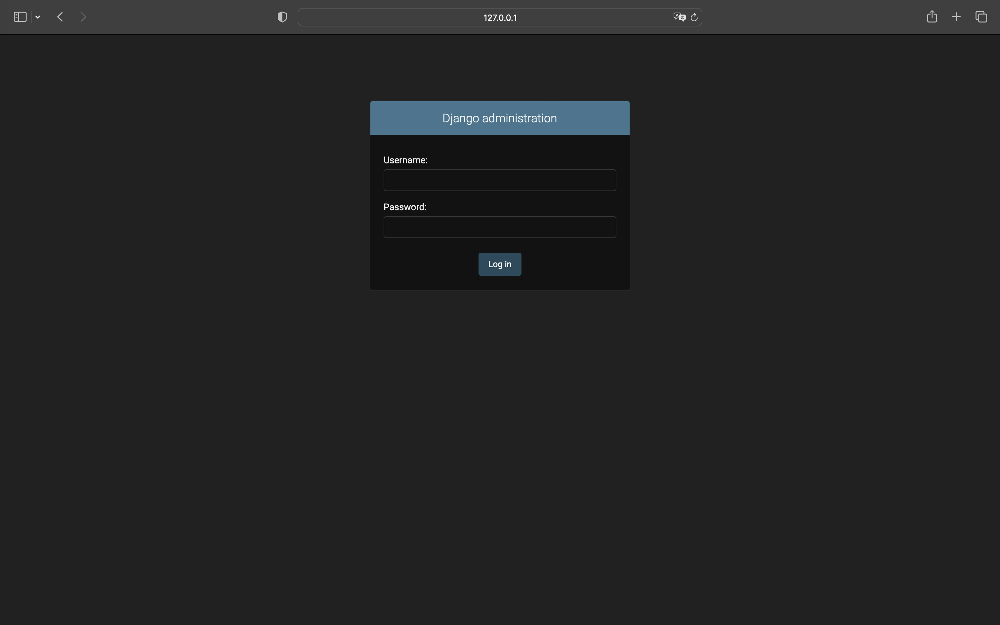
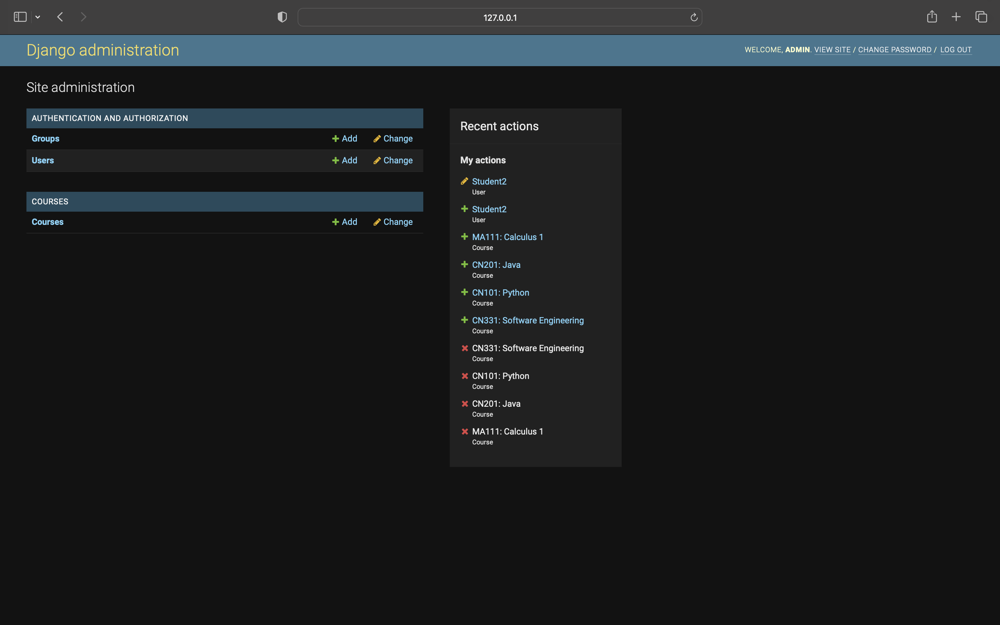
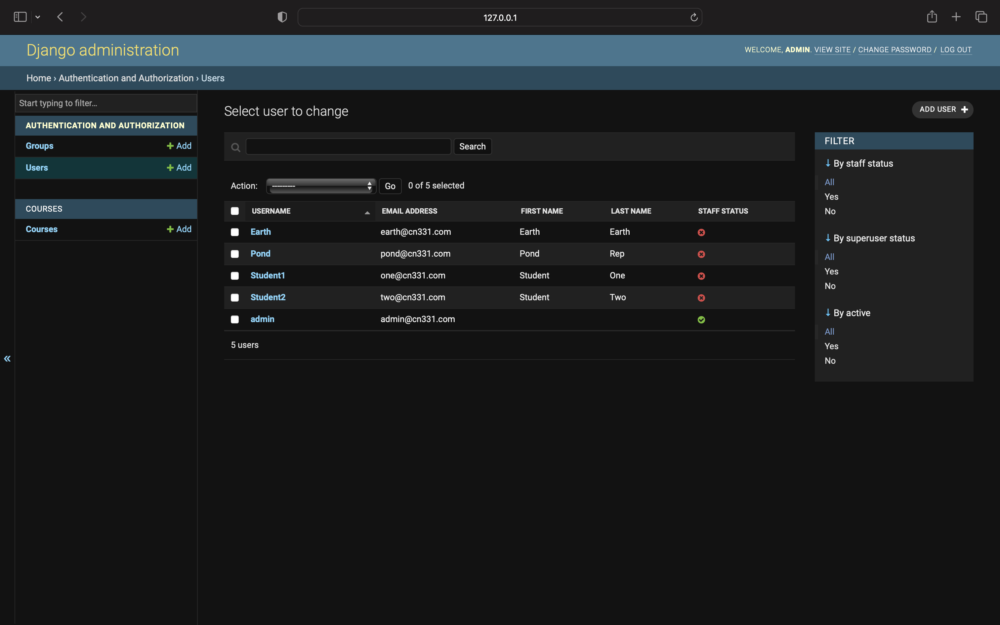

# CN331-AS2
## Assignment #2 - Create Django Web App

## **Group Member**
- ธรรมศาสตร์ ทองแกมแก้ว 6410685033
- ธนภัทร สาระธรรม 6410685140

## **Link**
- [Video How to use page](https://tuipied.sharepoint.com/:v:/s/Pond728/EdVG26hiNllNmShNvdREa68Bmr9n6YaMHjmvFqx36F16yA?e=7NiBMm)
- [GitHub repo url](https://github.com/cn331-6410685033/cn331-as2.git)

## **Web Details**
- Admin can create and edit Course. In Course, they can custom these following field. 
    - Course Code
    - Course Name
    - Yeat
    - Semester
    - Max Seat
    - Quota Available

- Users, (Students), can login and then they can see these following.
    - All Courses
    - My Courses
    - Available Courses

- Users, (Students), can enroll courses in "Course" page and withdraw enrolled courses in "My Courses" page.

## **Project Detail**
- Create Django Web App, Project's name: **"Quota"**
- There are 2 application in the Project.
    1. courses
    2. users

## How to use ***Student***

1. Login by fill in username and password.

2. Welcome Page.

3. Click "All Courses" to view all courses that have opened.

4. Click "Home" to return to Homepage (Welcome Page).

5. Click "My Courses" to view the courses that you have enrolled.

6. Click "Available Courses" to view the courses that you haven't enrolled yet.

7. Click "Log out" in Homepage to logout.

## How to use ***Admin***

### **Web page**
Admin is almost the same as student but Admin can see students that they have enrolled in each courses

### **Django Admin**
1. Get into url /admin to go to django admin login page. Fill in username and password. 
Username and password has to create by use terminal. 
 
python3 manage.py createsuperuser 
 

2. Django Admin first page

3. Click "Courses" in Courses to view courses.

    - Admin can create new course by click "ADD COURSE" in the top right side of page.
    - Admin can edit field in each course by clicking Course Code.

4. Admin can view Student by get into Users

    - Admin can create new student by click "ADD USER" in the top right side of page.
    - Admin can edit field in each student by clicking Username.